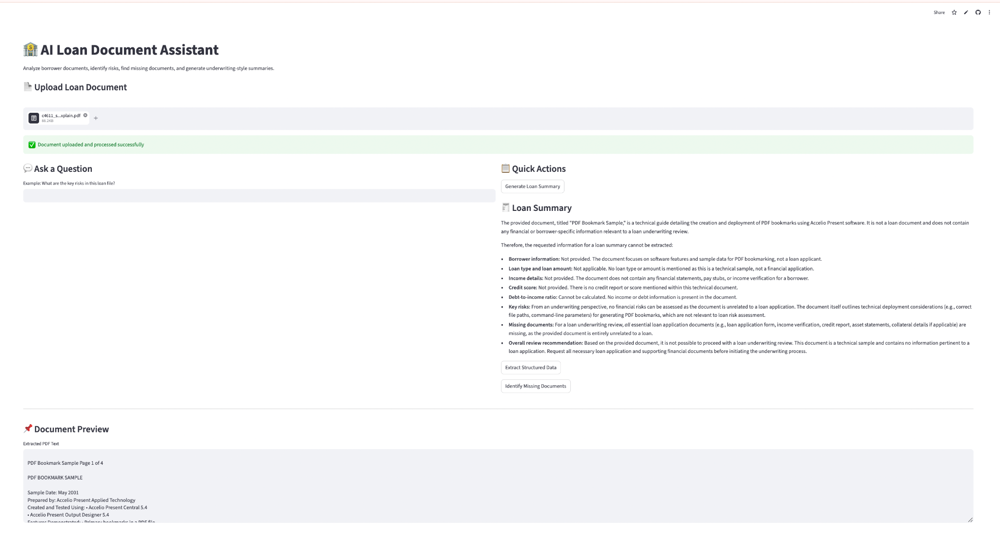

# AI Loan Document Assistant

AI-powered loan underwriting assistant that analyzes borrower PDF documents using LLM workflows and generates structured underwriting insights.

## Features
- Upload and analyze borrower loan documents
- Extract structured financial information
- Generate underwriting-style summaries
- Identify missing loan documents
- Risk factor analysis
- Question-answering over uploaded documents
- Real-time AI-powered workflow

## Tech Stack
- Python
- Streamlit
- Gemini API
- Prompt Engineering
- PDF Parsing
- RAG-style workflows
- GitHub
- Streamlit Cloud

## Architecture
User Upload → PDF Parsing → Context Extraction → LLM Prompt Pipeline → Underwriting Summary → Risk Analysis → Q&A

## Live Demo
https://ai-loan-document-assistant.streamlit.app

## Screenshots
### Main Interface and Loan Summary Output

## Future Improvements
- Vector database integration
- Embedding-based retrieval
- Multi-document reasoning
- Agentic workflow orchestration
- Authentication and secure document handling

## Author
Mahalakshmi Konakanchi
